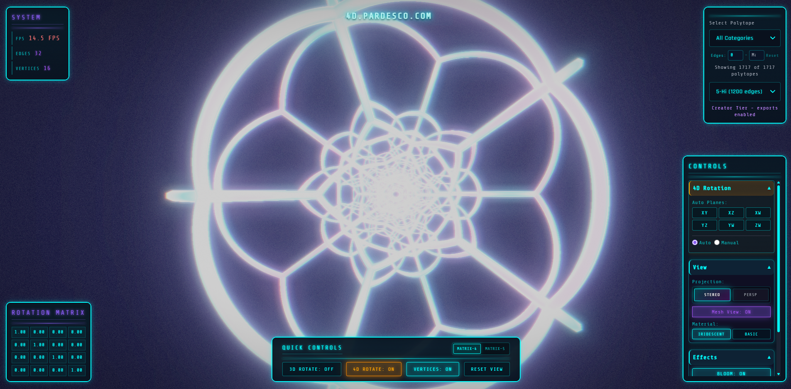
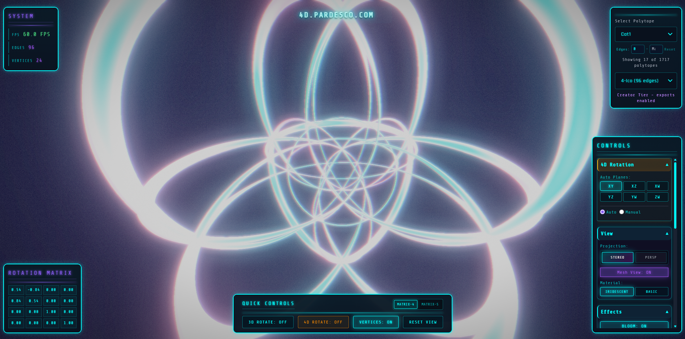
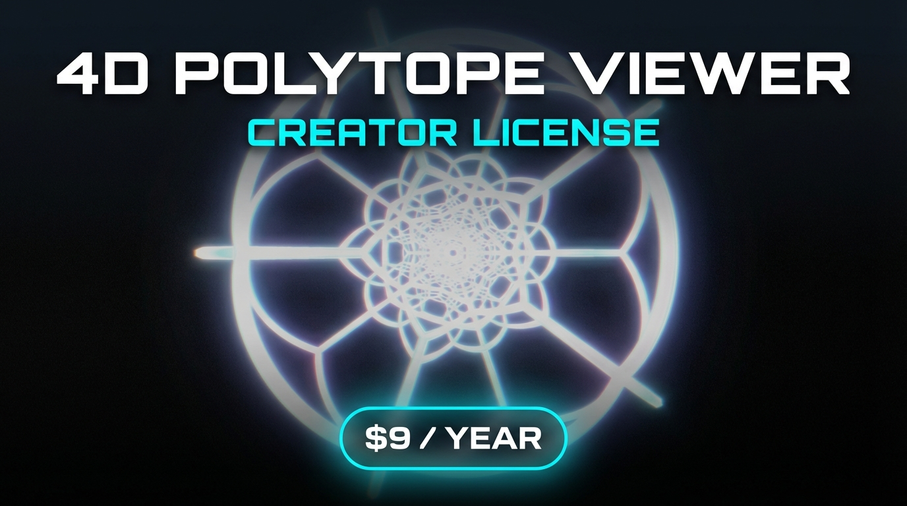
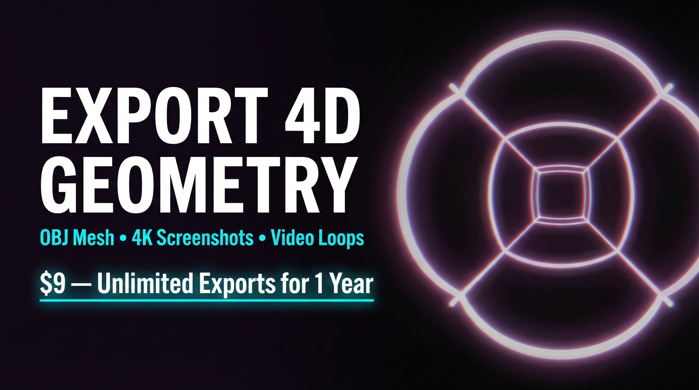
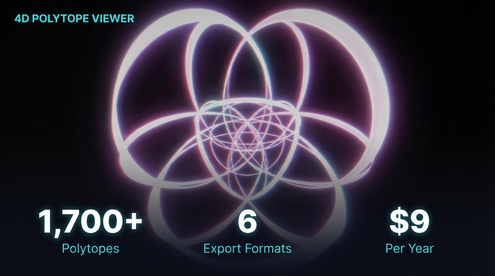

# 4D Polytope Viewer

[](LICENSE)

Interactive visualizations of 4D polytopes using stereographic projection and true 4D rotation.

**[Live Demo](https://4d.pardesco.com)**





## Features

- **True 4D rotation** across all 6 fundamental planes (XY, XZ, XW, YZ, YW, ZW)
- **Stereographic projection** with curved edges preserving conformal structure
- **1,700+ polytopes** -- the most comprehensive 4D polytope library online
- **Mesh view** with iridescent shader material
- **Bloom post-processing** for a glowing wireframe aesthetic
- **Matrix-5 mode** -- experimental 5D projection visualization
- **Manual rotation** with keyboard/mouse control and presets (Clifford, Hopf, Isoclinic)
- **Mobile support** with touch controls and responsive layout

## Quick Start

```bash
npm install
npm run dev
```

Open `http://localhost:3000` to launch the viewer.

## Tech Stack

- **Three.js** (r128) -- 3D rendering
- **Vite** -- build tooling
- **Vanilla JavaScript** -- no framework dependencies
- **Tailwind CSS** -- utility-first styling

## Architecture

```
src/
├── js/
│   ├── main.js                  # App entry point
│   ├── polytope/
│   │   ├── viewer.js            # Core PolytopeViewer class
│   │   ├── parser.js            # .off file parser
│   │   ├── stereographic.js     # 4D→3D projection math
│   │   ├── rotation4d.js        # 4D rotation matrices
│   │   └── projection5d.js      # 5D math utilities
│   ├── ui/
│   │   ├── controls.js          # Viewer controls
│   │   ├── polytope-selector.js # Polytope dropdown
│   │   └── MatrixDisplay.js     # Rotation matrix HUD
│   ├── effects/
│   │   ├── BloomEffect.js       # Post-processing glow
│   │   └── ParticleField.js     # Background particles
│   ├── materials/
│   │   └── IridescentMaterial.js # Holographic shader
│   └── shaders/
│       └── Matrix5Shader.js     # 5D projection shader
├── styles/
│   ├── main.css
│   └── mobile.css
└── data/
    ├── polytopes/               # .off geometry files
    └── polytope-lists/          # Polytope catalog JSON
```

## How It Works

1. Load a `.off` file containing 4D vertex coordinates and edge connectivity
2. Apply 4D rotation matrices across user-selected planes
3. Project 4D vertices to 3D via stereographic or perspective projection
4. Generate curved edge geometry using CatmullRom interpolation
5. Render as wireframe lines or tube meshes with bloom post-processing

## Support the Project

If you find this viewer useful, consider supporting development with a **Creator License** -- it unlocks export features and helps keep this project alive.

[](https://4d.pardesco.com)

[](https://4d.pardesco.com)

[](https://4d.pardesco.com)

**[Get Creator License at 4d.pardesco.com](https://4d.pardesco.com)** -- OBJ mesh export, 4K screenshots, video loops, animation JSON for Blender. $9/year.

---

Made by [Randall Morgan](https://github.com/Pardesco) 2025

## License

[MIT](LICENSE)
